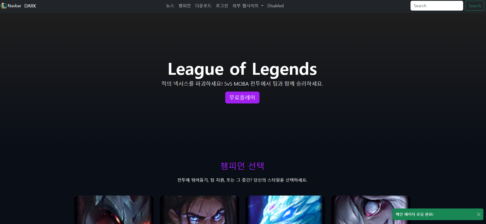
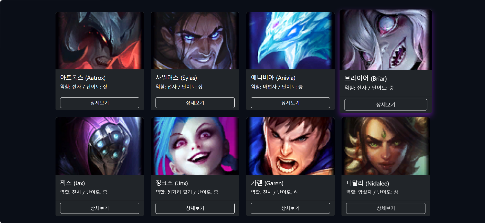
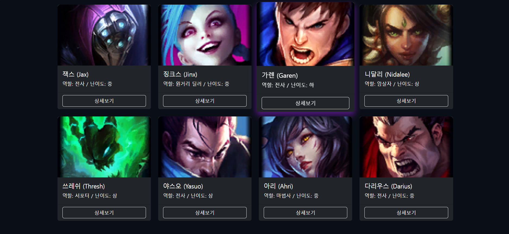
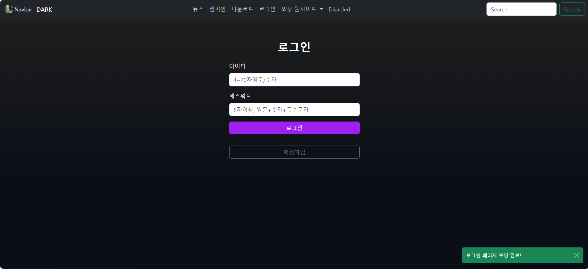
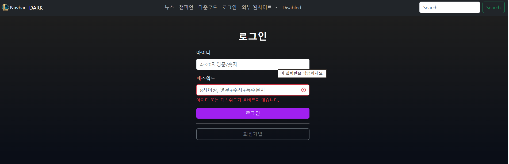
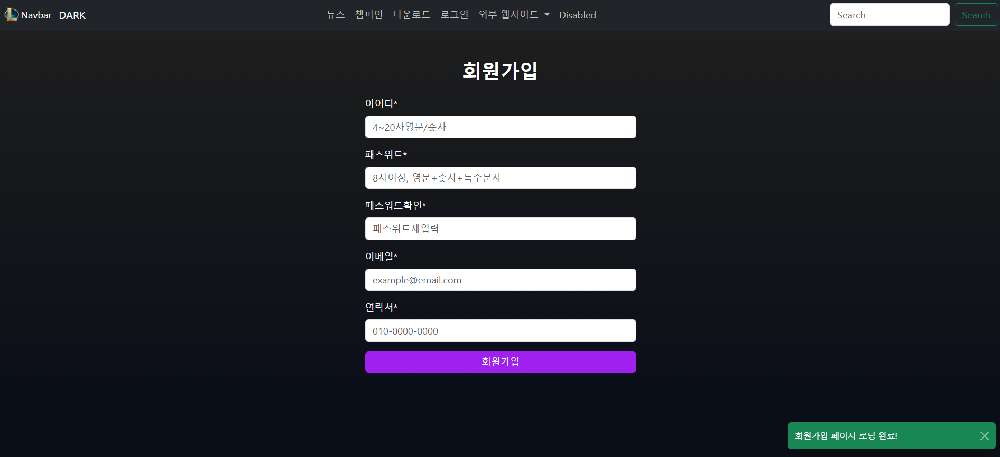
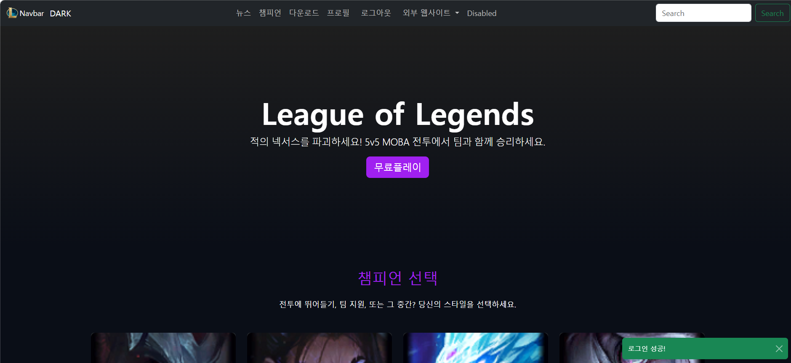
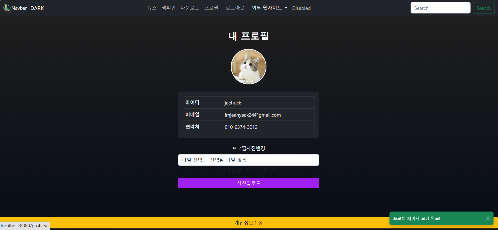
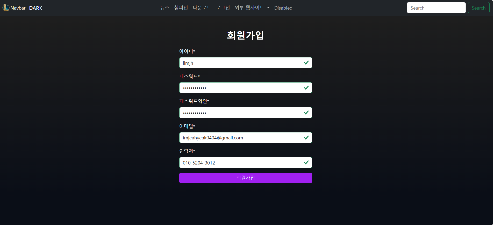

# Quarkus 프로젝트 시작!(학번: 20231019/이름: 임재혁)
자바웹프로그래밍(1) LOL 웹사이트 기말 과제

## 기말 과제 실습 내용

    
    
    
    
    
    
    
    
    
    
    
    

 

## 기말고사 시험 공부 내용
9주차: 
js 다크/라이트 모드 구현 
MySQL 연동 

10주차: 
로그인 구현 

11주차: 
로그인/로그아웃 구현 
회원가입 구현 

12주차: 
암호화 구현
로그인 - 암호화 구현 
프로필 구현 

13주차: 
프로필 구현 
회원 정보 수정 

## 기말 과제 웹사이트 설명
@프로젝트 구조 
java-web_20231019 
│ 
├── src/ 
│   ├── main/ 
│   │   ├── java/                     # Java 소스코드 (컨트롤러, 서비스, 모델 등) 
│   │   ├── resources/                # 설정 파일, 템플릿, 정적 리소스 
│   │   │   ├── META-INF/resources/   # HTML, CSS, JS 파일이 위치하는 실제 웹 루트 
│   │   │   └── application.properties # 설정 파일 
│   │ 
│   └── test/                         # 테스트 코드 
│ 
├── .mvn/                             # Maven Wrapper 설정 
├── pom.xml                           # Maven 프로젝트 설정 
├── mvnw / mvnw.cmd                   # Maven Wrapper 실행 파일 
├── .gitignore 
└── README.md  

============================================================================  

@웹사이트 구조 
1.메인 페이지 
사이트 소개 및 기본 UI 제공 
로그인 여부에 따라 다른 메뉴 표시 
세션 체크 기능 포함 

2.회원가입 기능 
사용자 정보 입력 
비밀번호 암호화 저장 
중복 ID 체크 
MySQL 연동하여 DB 저장 

3.로그인 / 로그아웃 기능 
입력한 ID/PW를 DB와 비교 
암호화된 비밀번호 검증 
로그인 성공 시 세션 생성 
로그아웃 시 세션 삭제 

4.프로필 페이지 
로그인한 사용자 정보 표시 
프로필 이미지, 닉네임, 이메일 등 조회 
DB에서 사용자 정보 불러오기 

5.회원 정보 수정 
프로필 정보 변경 
비밀번호 변경 시 암호화 적용 
변경된 정보 DB 업데이트 

6.다크/라이트 모드 (JavaScript) 
JS로 테마 전환 기능 구현 
LocalStorage 저장 → 새로고침해도 유지  

============================================================================  

@페이지 흐름도 (Website Flow) 
[메인 페이지] 
    │ 
    ├── (로그인 X) → [로그인 페이지] → 로그인 성공 → 세션 생성 → 메인 페이지로 이동 
    │ 
    ├── (회원가입 버튼) → [회원가입 페이지] → 가입 완료 → 로그인 페이지로 이동 
    │ 
    ├── (로그인 O) → [프로필 페이지] 
    │        │ 
    │        ├── [회원 정보 수정 페이지] → 수정 완료 → 프로필 페이지 
    │        │ 
    │        └── 로그아웃 → 세션 삭제 → 메인 페이지 
    │ 
    └── (캐릭터 카드 클릭) → [Bootstrap Modal] → 캐릭터 상세 정보 표시  

✔ 흐름도 설명 
로그인하지 않은 사용자는 프로필 페이지 접근 불가 
로그인 성공 시 HttpSession 생성 → 로그인 상태 유지 
로그아웃 시 세션 삭제 후 메인 페이지로 이동 
캐릭터 카드는 로그인 여부와 상관없이 모달로 정보 표시  

============================================================================  
@기술 스택 
Backend: Quarkus (Java, RESTEasy Reactive, Hibernate ORM, JDBC MySQL Driver) 
Frontend: HTML5, CSS3, JavaScript(ES6), Bootstrap 5(Modal, Card, Navbar 등) 
Database: MySQL 8.x + MySQL Connector/J 
기타: SHA-256 Password Hashing, HttpSession 기반 로그인 관리  

@기술 스택 상세 설명 
*Backend: Quarkus (Java)* 
사용 확장(Extensions): 
quarkus-resteasy-reactive, quarkus-hibernate-orm, quarkus-jdbc-mysql, quarkus-arc(CDI) 
REST API 개발: JAX-RS 기반 (@Path, @GET, @POST) 
ORM: Hibernate ORM으로 엔티티 매핑 및 CRUD 처리 
의존성 주입: CDI(Arc) 사용 
Dev Mode 지원: 코드 변경 시 서버 자동 리로드  

*Frontend: HTML5, CSS3, JavaScript + Bootstrap 5* 
HTML5로 페이지 구조 작성 
CSS3로 기본 스타일링 및 반응형 레이아웃 구성 
JavaScript(ES6)로 다크/라이트 모드 구현 (LocalStorage 저장) 
Bootstrap 5 컴포넌트 사용: 
Modal → 캐릭터 상세 정보 표시 
Card → 챔피언 카드 UI 
Navbar → 상단 메뉴 
Grid System → 반응형 레이아웃 
JS로 Bootstrap Modal에 동적 데이터 삽입  

*Database: MySQL* 
버전: MySQL 8.x 
드라이버: MySQL Connector/J (mysql-connector-java) 
사용자 정보 저장 테이블 구성 (id, password, email, nickname 등) 
Hibernate ORM 또는 JDBC로 CRUD 처리  

*기타 기술 요소* 
SHA-256 Password Hashing 
비밀번호를 SHA-256 알고리즘으로 해시 후 DB에 저장  

HttpSession 기반 로그인 관리 
로그인 성공 시 세션 생성 → 페이지 이동 시 로그인 상태 유지  

Bootstrap Modal + JS 이벤트 처리 
카드 클릭 → JS로 데이터 읽기 → Modal에 삽입 → Modal 표시  

다크/라이트 모드 
JS로 테마 전환, LocalStorage로 사용자 설정 저장  

============================================================================  

@캐릭터 카드 & Bootstrap 모달 기능 설명 
웹사이트에서는 LOL 챔피언 캐릭터 카드(Champion Card)를 사용하여 
사용자가 캐릭터 정보를 직관적으로 확인할 수 있도록 구성되어 있다. 
각 캐릭터 카드는 Bootstrap Card 컴포넌트를 기반으로 제작되었으며, 
카드를 클릭하면 Bootstrap Modal이 실행되어 캐릭터 상세 정보를 보여준다.  

✔ 캐릭터 카드 기능 
Bootstrap의 card 클래스를 활용해 캐릭터 이미지 + 이름을 표시 
카드 클릭 시 JavaScript 이벤트가 실행되어 모달을 띄움 
반응형 UI로 모바일에서도 자연스럽게 정렬됨  

✔ Bootstrap 모달 기능 
Bootstrap의 modal 컴포넌트를 사용하여 팝업 형태로 정보 표시 
캐릭터 설명, 역할(Role), 난이도, 스킬 정보 등을 표시 가능 
모달은 HTML에 미리 만들어두고, JS로 내용만 동적으로 변경 가능  

✔ JavaScript 연동 방식 
각 카드에 data-* 속성을 부여하여 캐릭터 정보를 저장 
카드 클릭 시 JS가 해당 데이터를 읽어 모달 내부에 삽입 
document.getElementById() 또는 querySelector()로 모달 요소 접근 
new bootstrap.Modal()을 통해 모달을 실행  

✔ 동작 흐름 
사용자가 캐릭터 카드를 클릭한다. 
JS가 클릭된 카드의 data-name, data-img, data-desc 등을 읽는다. 
모달 내부의 제목, 이미지, 설명 영역에 데이터를 삽입한다. 
Bootstrap 모달이 화면에 표시된다.  

============================================================================  

@ERD (데이터베이스 테이블 구조) 
아래는 MySQL에서 사용되는 users 테이블 ERD 구조이다. 
회원가입, 로그인, 프로필, 정보 수정 기능을 모두 지원하기 위한 최소 구성이다.  

📌 users 테이블 
users 
├── id (INT, PK, AUTO_INCREMENT)        # 고유 사용자 번호 
├── username (VARCHAR)                  # 로그인 ID (중복 불가) 
├── password (VARCHAR)                  # SHA-256 해시 비밀번호 
├── email (VARCHAR)                     # 이메일 
├── nickname (VARCHAR)                  # 닉네임 
└── profile_img (VARCHAR)               # 프로필 이미지 경로  

✔ ERD 설명 
id → 기본키(PK), 자동 증가 
username → UNIQUE, 로그인 ID로 사용 
password → SHA-256 해시 문자열 저장 
email → 사용자 이메일 
profileImage → 프로필 이미지 파일명 또는 URL  
