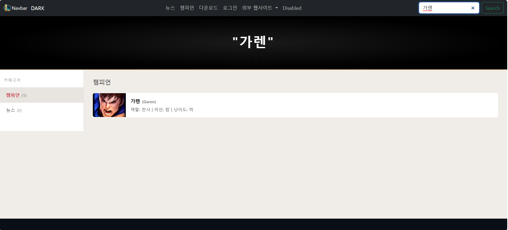
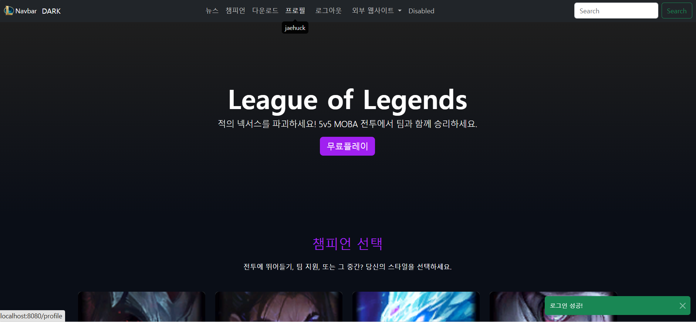
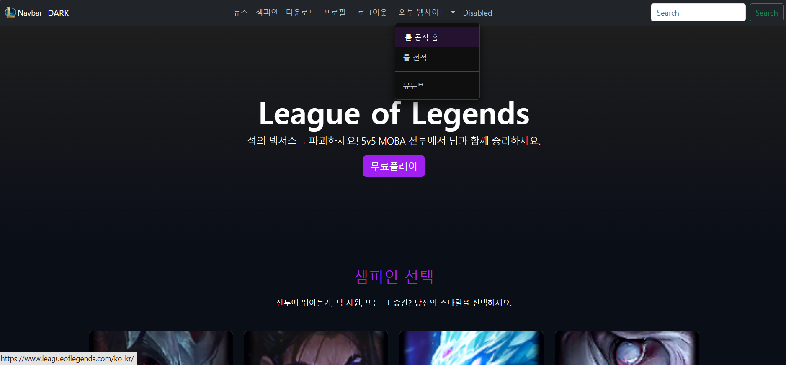
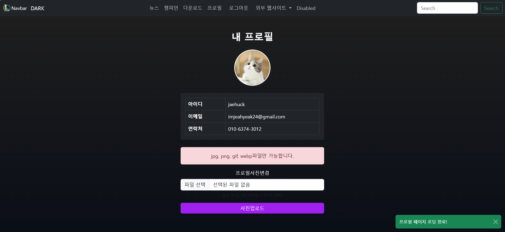
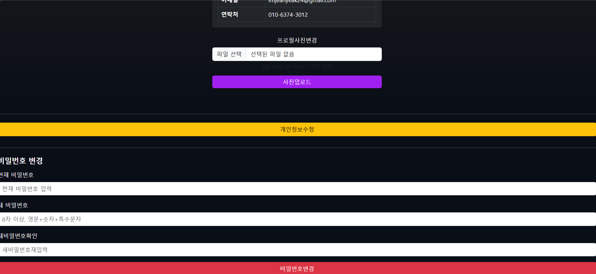
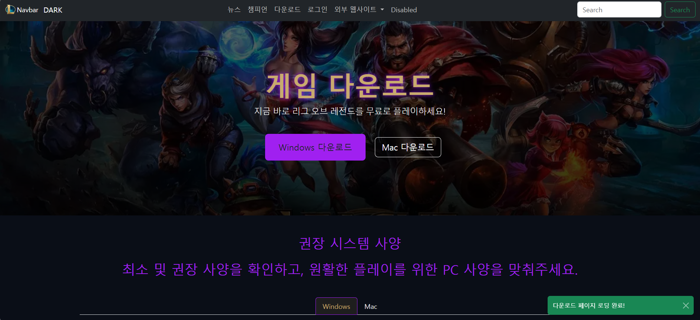
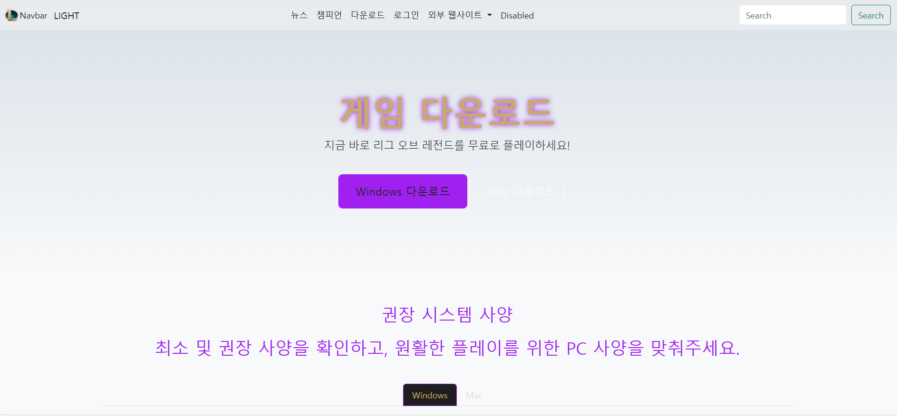

# Quarkus 프로젝트 시작!(학번: 20231019/이름: 임재혁)
자바웹프로그래밍(1) LOL 웹사이트 기말 과제

## 기말 과제 실습 내용

    
    
    
    
    
    
    
    
    
    
    
    
    
    
    
    
    
    
    
    

  

## 기말고사 시험 공부 내용
9주차:  
js 다크/라이트 모드 구현  
MySQL 연동  

10주차:  
로그인 구현  

11주차:  
로그인/로그아웃 구현  
회원가입 구현  

12주차:  
암호화 구현
로그인 - 암호화 구현  
프로필 구현  

13주차:  
프로필 구현  
회원 정보 수정  

## 기말 과제 웹사이트 주차별 구현 과제 설명
**구현 과제에 대한 결과는 기말 과제 실습 내용에서 확인하시면 됩니다.**  
(스크린샷 사진 순서)  
s1 s2  
..  
s19 s20  

중간고사 이전  
4~5주차 마무리 과제: 추가 구현 - 스크린샷 s1 ~ 4   
(1)상단 좌측 이미지 - LOL 로고 삽입  
(2)네비바 가운데 정렬  
(3)챔피온 카드 추가 + 상세 모달 추가 구현  
→ 기존 챔피언 카드: 아트록스, 사일러스, 애니비아, 브라이어, 잭스, 징크스  
→ 추가된 챔피언 카드: 가렌, 니달리, 쓰레쉬, 야스오, 아리, 다리우스  
  

6~7주차 마무리 과제: 추가 구현  
(1)데이터 정의 추가  
(2)검색어 기능 추가  
→ 검색어가 없거나 공백인 경우 메인 화면으로 돌아가기  
  

중간고사 이후  
9주차 마무리 과제: 추가 구현 - 스크린샷 s5 ~ 6   
(1)챔피언 검색 결과 모달창 띄우기  
(2)자바스크립트 호출 방식 변경, 모든 페이지에 동일 적용  
→ 기존 토글 함수 - 인라인 방식  
→ 이벤트 리스너(addEventListener)로 변경  
→ champions.js, modal.js로 모달창을 띄우는 함수 추가 구현  
→ modal.js에 이벤트 리스너 추가  
  

10주차 마무리 과제: 추가 구현 - 스크린샷 s19 ~ 20  
로그인 페이지의 다크/라이트 모드 구현  
→ 모든 페이지에 다크/라이트 모드 적용  
  

11주차 마무리 과제: 추가 구현 - 스크린샷 s7  
로그인 화면 입력값 체크  
→ 아이디 유효성 검사 - 4~20자 영문/숫자만 허용  
→ 패스워드 유효성 검사 - 8자 이상, 영문 + 숫자 + 특수문자(!@#$%^&*) 포함  
  

12주차 마무리 과제: 추가 구현 - 스크린샷 s8, s16  
(1)로그인 에러 처리 - 로그인 실패 시 오류 메시지 출력 - 스크린샷 s8  
(2)업로드 에러 처리 - 사진 업로드에 대한 오류 메시지 없음 - 스크린샷 s16   
  

13주차 마무리 과제: 추가 구현 - 스크린샷 s1 ~ 20   
토스트로 교체  
→ 모든 페이지에 토스트 메시지 출력  
  

그 외 추가 구현:  
(1)모달창 HTML 중복 제거 - 스크린샷 s5 ~ 6  
캐릭터 카드 상세보기 클릭 시 HTML 화면 중복되는 것을 방지하고자 메인 HTML에 공통 모달 요소만 남기고  
champions.js, modal.js를 추가 구현하여 모달 클릭 시 상세정보 관련 HTML이 중복되지 않게 나오게 함.  
  

(2)네비바 간단한 추가 디자인 - 스크린샷 s14  
네비바 외부 웹사이트 클릭 시 디자인을 메인 화면의 UI와 비슷하게 설정해봄.  
외부 웹사이트 클릭 시 롤 공식홈, 롤 전적, 유튜브 드롭다운이 나오고 마우스를 대면 보라색으로 색이 변함.  
  

(3)최종 마무리 구현 - 다크/라이트 모드 유지(세션 응용)  
sessionStorage.setItem, sessionStorage.getItem을 기존의 toggle 함수에 추가함.   
메인페이지에서 다운로드 페이지, 로그인 페이지 등 페이지 이동 시 다크/라이트 모드 유지 구현을 함. 

## 기말 과제 웹사이트 구조 설명
@페이지 흐름도 (Website Flow)  
[메인 페이지]  
    │  
    ├── (로그인 X) → [로그인 페이지] → 로그인 성공 → 세션 생성 → 메인 페이지로 이동  
    │  
    ├── (회원가입 버튼) → [회원가입 페이지] → 가입 완료 → 로그인 페이지로 이동  
    │  
    ├── (로그인 O) → [프로필 페이지]  
    │        │  
    │        ├── [회원 정보 수정 페이지] → 수정 완료 → 프로필 페이지  
    │        │  
    │        └── 로그아웃 → 세션 삭제 → 메인 페이지  
    │  
    └── (캐릭터 카드 클릭) → [Bootstrap Modal] → 캐릭터 상세 정보 표시    

