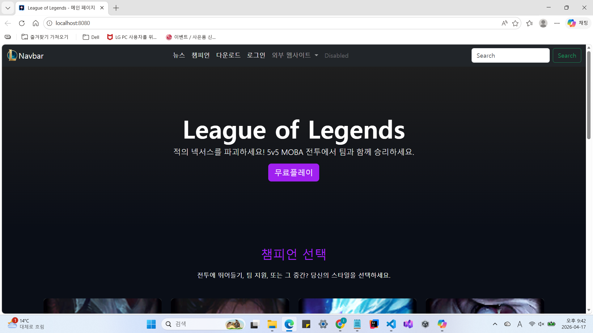
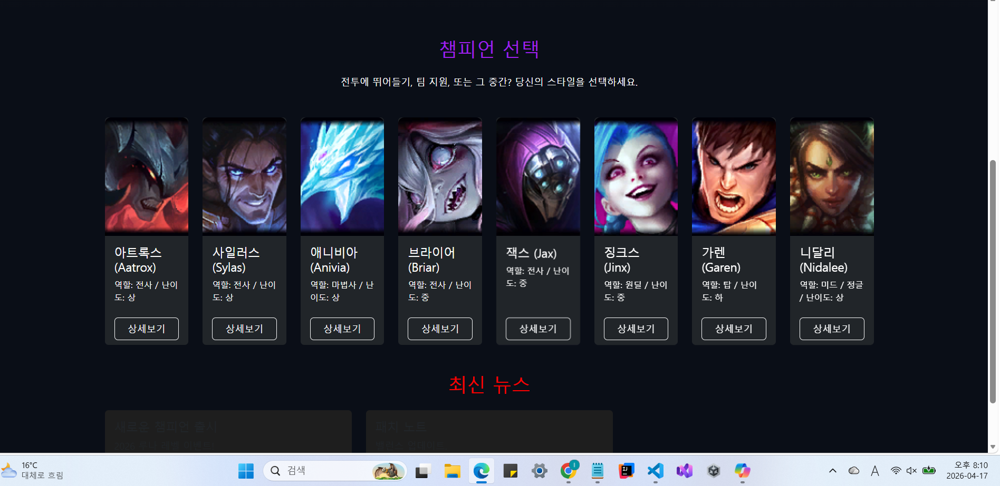
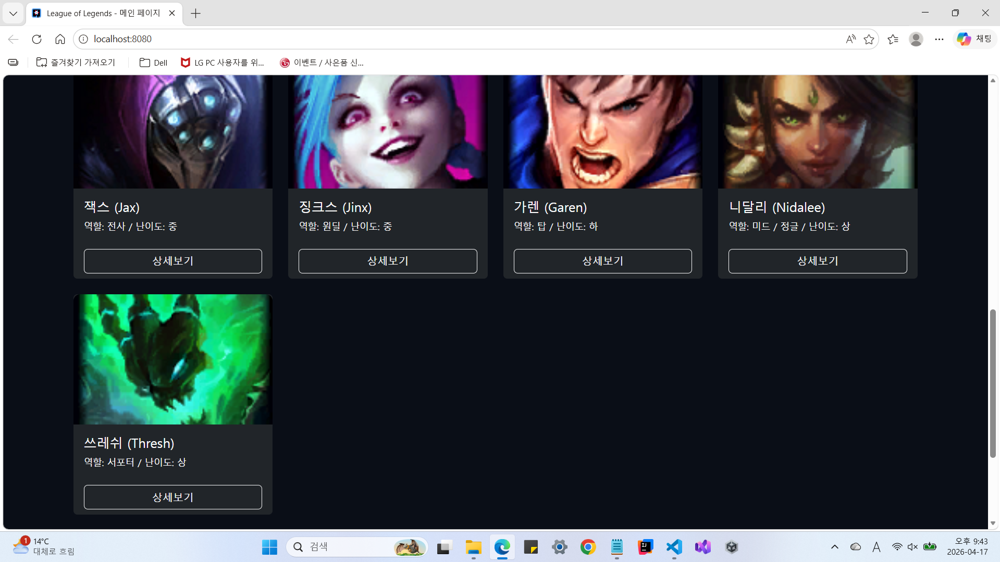
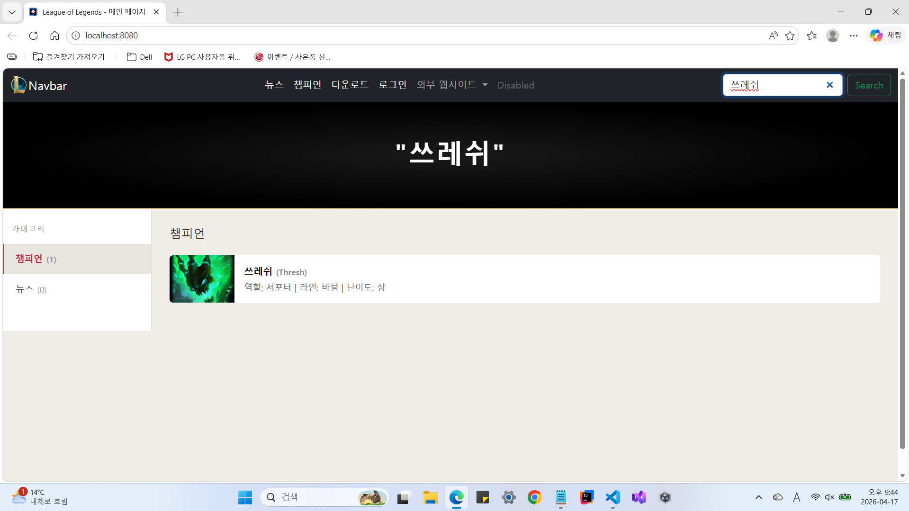

# 자바웹프로그래밍(1)(학번: 20231019/이름: 임재혁)
LOL웹사이트 - 수업 내용 정리

## 9주차 내용

    
    
    
     

 

## 과제 구현 실습 내용
1. 상단 좌측 lol로고 삽입 
2. 네비게이션바 가운데 정렬 
3. 챔피언 카드 가렌/니달리/쓰레쉬 추가 
4. 각 채피언의 모달(Modal) 상세 내용 추가 
5. 기존 데이터(아트록스, 사일러스 등) 외에 새로운 데이터 3종 추가 
6. 검색어 기능 구현 
7. 검색 결과 화면 전환 기능 추가 
8. 검색어 없을 때 메인 화면 복귀 기능 추가 

## 9주차 실습 내용
자바스크립트 다크모드/라이트모드 구현
MySQL 연동
